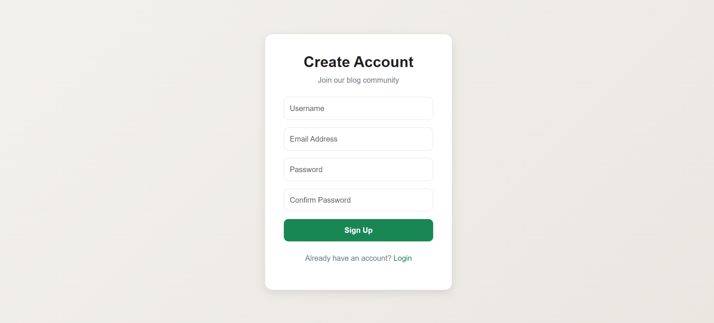
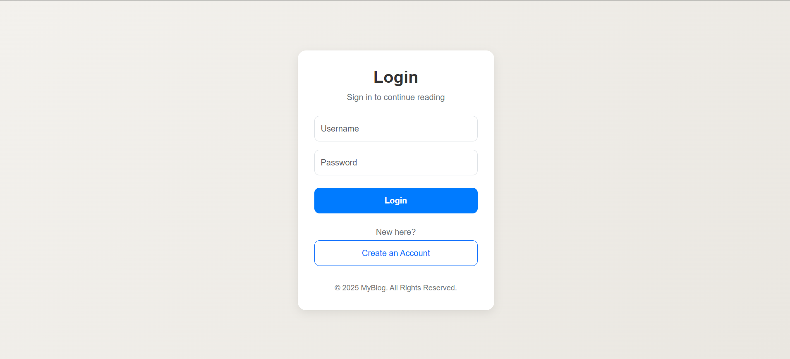
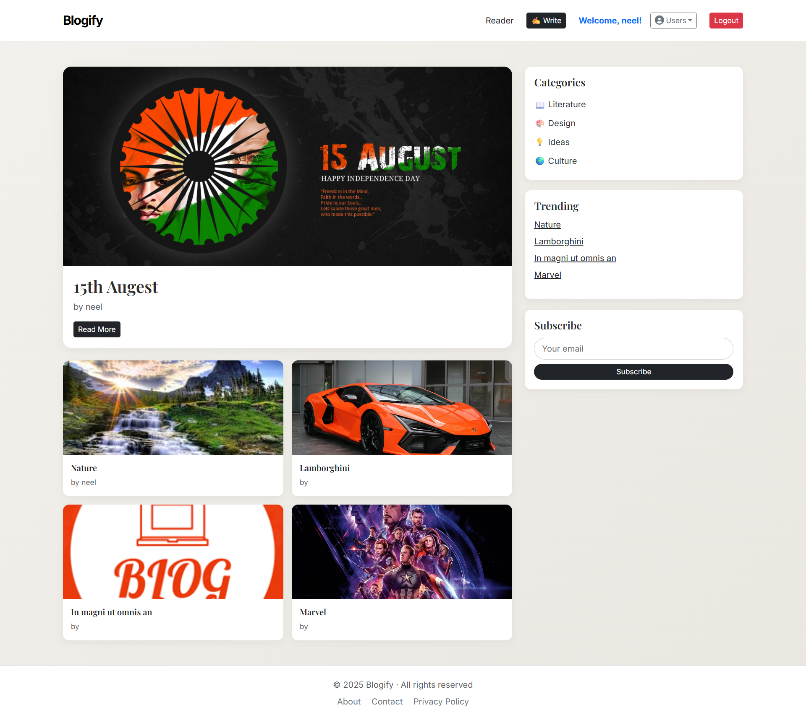
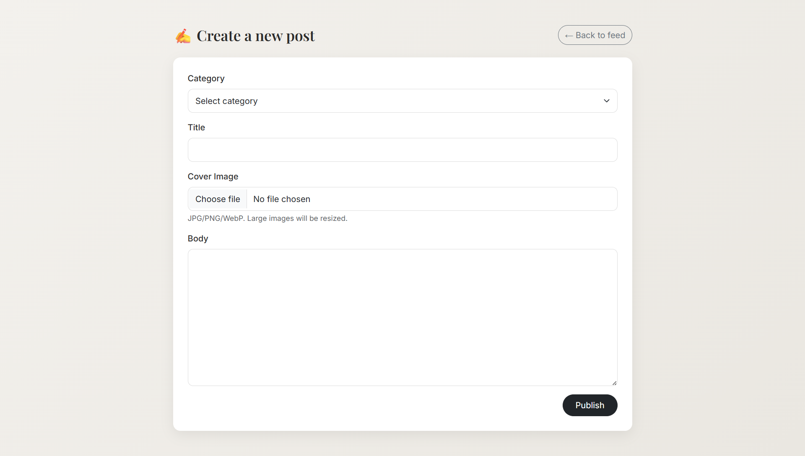
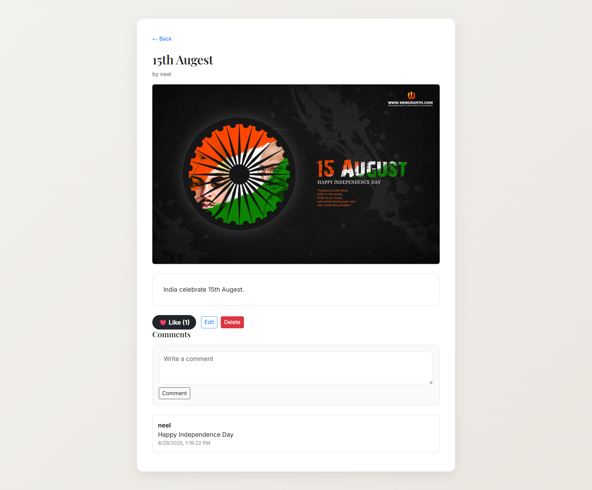
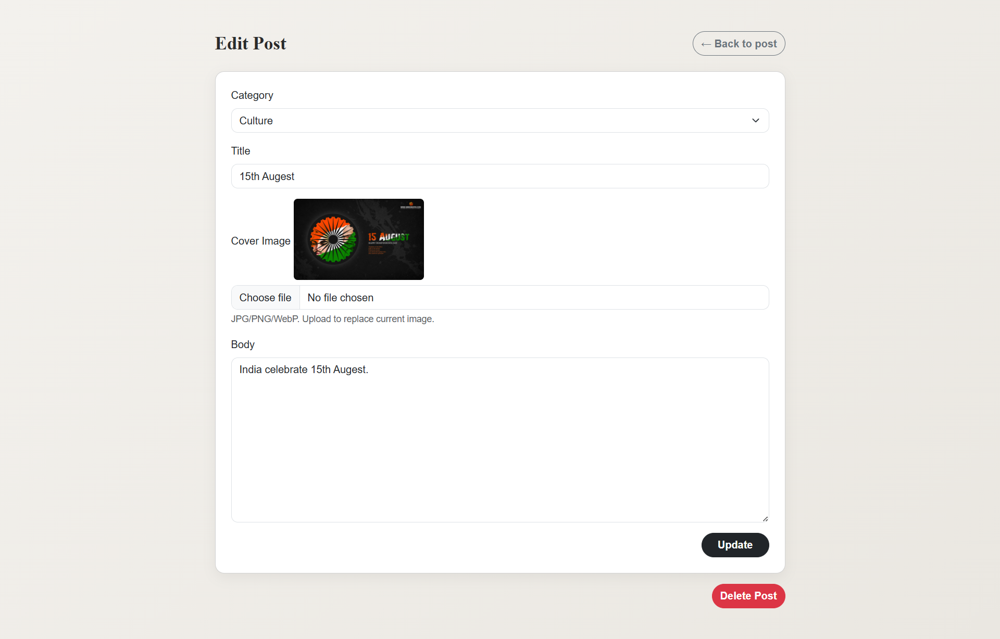
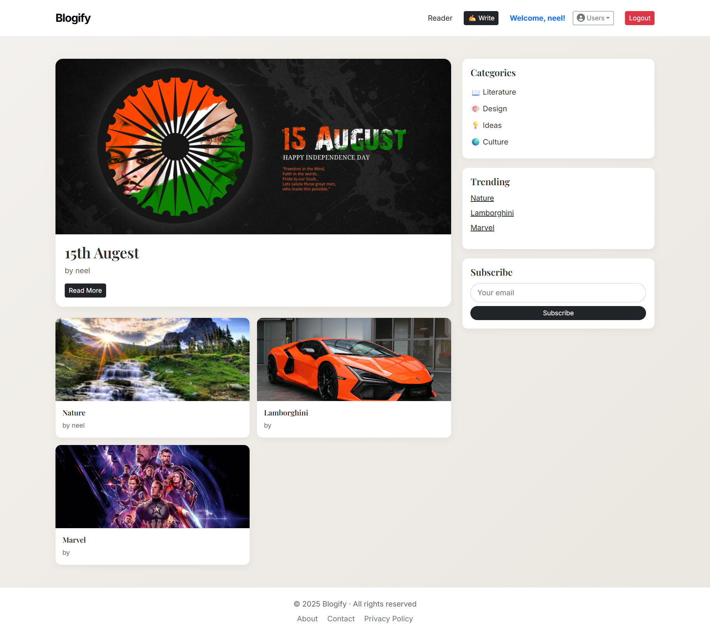
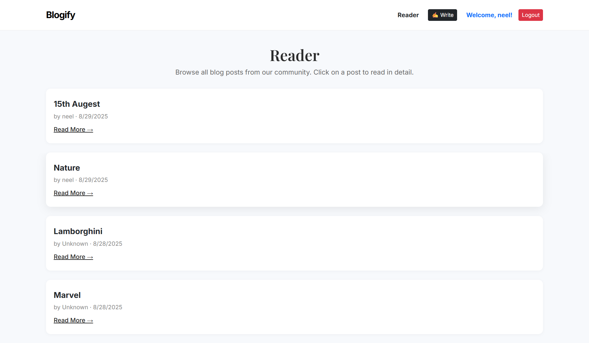
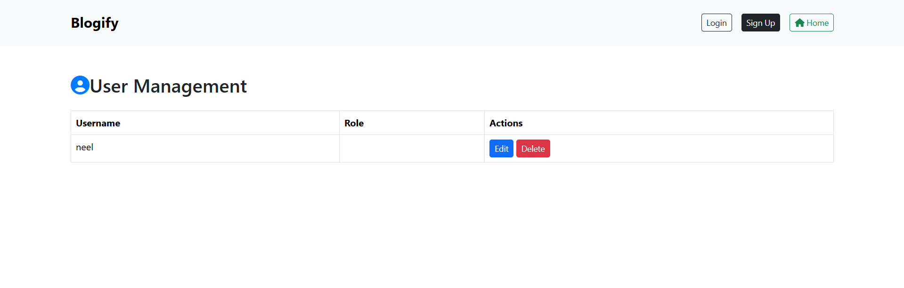

# Node.js Blog Platform

A full-featured blog platform built with Node.js, Express, MongoDB, and EJS. This project allows users to create, edit, view, and manage blog posts with authentication and user management features.

## Features
- User authentication (signup, login, logout)
- Create, edit, and delete blog posts
- User profile management
- Image uploads (Cloudinary integration)
- Responsive UI with EJS templates
- DataTables for admin/user management

## Deploy Link
- Link: 

## Project Structure
```
index.js                # Main server entry point
configs/                # Configuration files (DB, Cloudinary, etc.)
controllers/            # Route controllers
middlewares/            # Express middlewares (auth, upload, etc.)
models/                 # Mongoose schemas
public/                 # Static assets (CSS, JS, images)
routers/                # Express route definitions
views/                  # EJS templates
output_img/             # Screenshots and output images
```

## Getting Started

### Prerequisites
- Node.js (v14 or higher recommended)
- MongoDB instance (local or cloud)
- Cloudinary account (for image uploads)

### Installation
1. Clone the repository:
   ```sh
   git clone <repo-url>
   cd Node.js_Blog_PR
   ```
2. Install dependencies:
   ```sh
   npm install
   ```
3. Configure environment variables:
   - Create a `.env` file in the root directory.
   - Add your MongoDB URI, Cloudinary credentials, and any other required variables.

4. Start the server:
   ```sh
   npm start
   ```
   or
   ```sh
   node index.js
   ```

5. Visit `http://localhost:8081` in your browser.

## Folder Details
- **configs/**: Database and Cloudinary configuration files.
- **controllers/**: Logic for handling requests and responses.
- **middlewares/**: Custom middleware for authentication and file uploads.
- **models/**: Mongoose schemas for users and posts.
- **public/**: Static files (CSS, JS, images).
- **routers/**: Express route definitions.
- **views/**: EJS templates for rendering pages.
- **output_img/**: Screenshots of the application.

## Screenshots
Screenshots are available in the `output_img/` folder.
1.signup:
2.login:
3.home:
4.create:
5.view:
6.edit:
7.delete:
8.reader:
9.usermanage:

## License
This project is licensed under the MIT License.